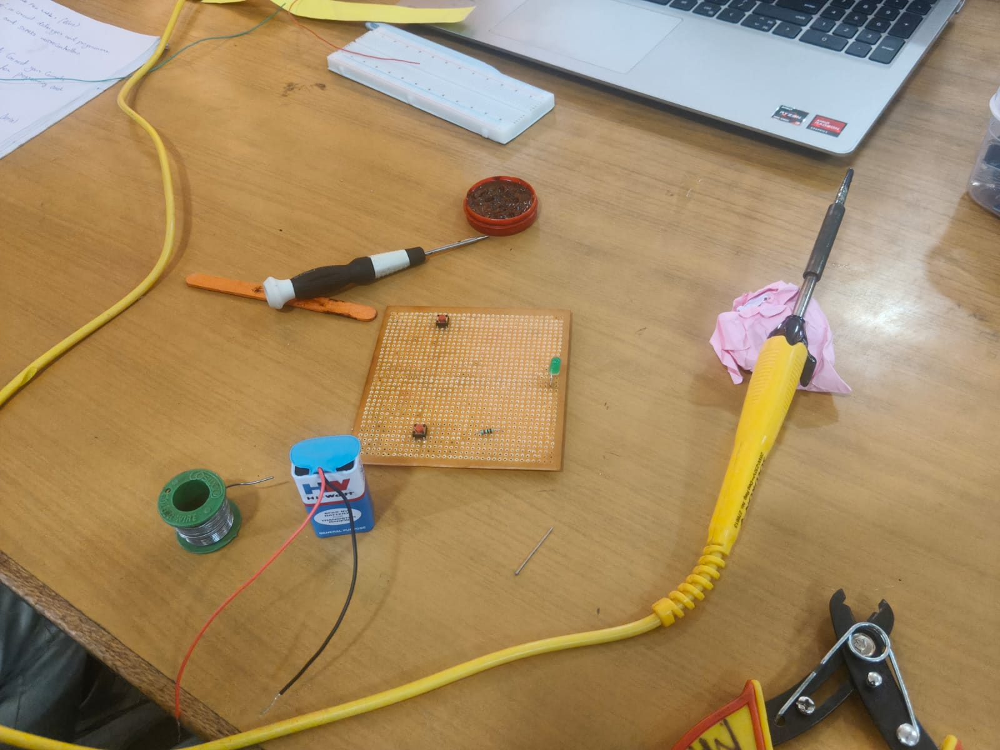
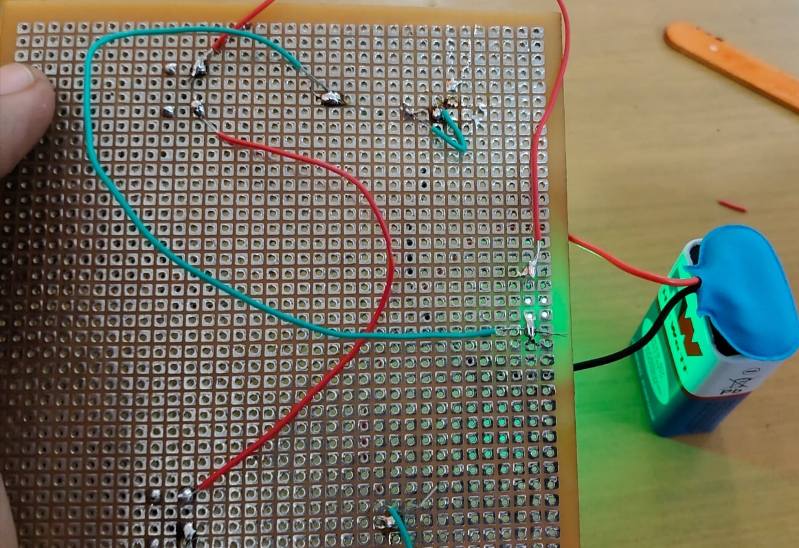
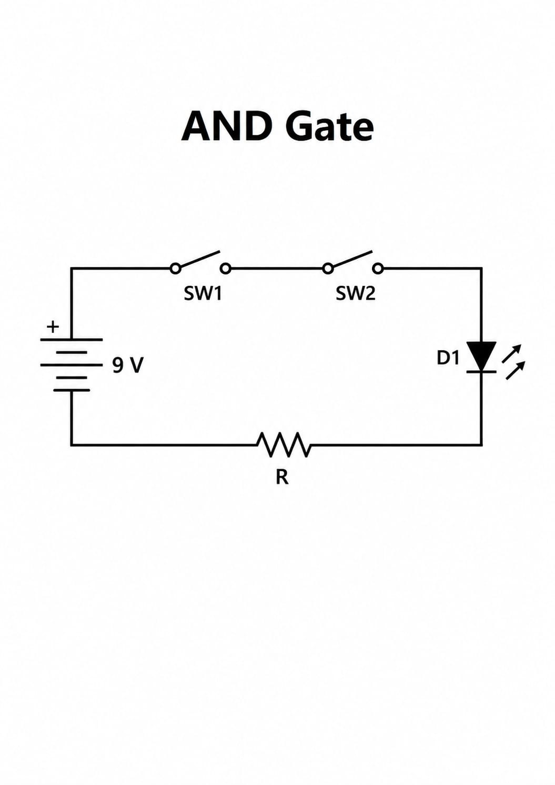
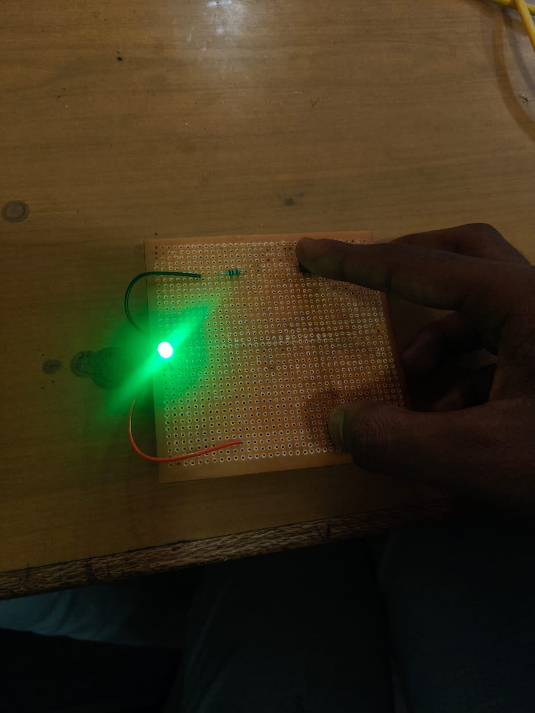

TWO-INPUT LOGICAL AND GATE CIRCUIT USING PUSH SWITCHES AND LED
1. TITLE
Two-Input Logical AND Gate Circuit Using Push Switches and LED
2. PROBLEM STATEMENT
Logic gates are the basic building blocks of digital electronics, but their switching behavior is often taught only through truth tables and symbols, without a physical demonstration. A simple, low-cost hardware circuit is needed to show how an AND gate's output depends on the state of two inputs together, so that the logic can be observed directly rather than only calculated.
3. SOLUTION
A discrete AND gate was built using two push-button switches (SW1 and SW2) connected in series with a current-limiting resistor and an LED, powered by a 9 V battery. Because the switches are in series, current can reach the LED only when both SW1 and SW2 are pressed at the same time, which reproduces AND logic in hardware. The circuit was built on a soldered perforated board (PCB) rather than a solderless breadboard.
4. OBJECTIVE
To design and build a two-input AND gate using push switches, a resistor and an LED, to verify its truth table using simulation and hardware, and to demonstrate that the LED lights only when both switches are pressed together.
5. COMPONENTS USED
Table 5.1: List of components used
S.No.
Component
Quantity
Value / Rating
Purpose
1
DC battery
1
9 V
Power supply
2
Push-button switch
2
SW1, SW2 (momentary)
Represent the two logic inputs
3
Resistor (R)
1
Value to be confirmed
Limits the LED current
4
LED (D1)
1
Green
Represents the logic output
5
Perforated board (PCB)
1
General-purpose, soldered
Circuit assembly
6
Connecting wires
As required
Red and green single-core
Interconnections
6. CIRCUIT SETUP AND CONNECTIONS
6.1 Hardware Circuit
The circuit was assembled on a soldered perforated board, as shown in Figure 5.1. The 9 V battery, the resistor and the LED are visible, along with the two push-button switches mounted at opposite corners of the board.
   
Figure 5.1: Perforated-board AND gate circuit with battery, resistor, LED and two push switches
   
Figure 5.2: Underside view of the soldered connections with the battery attached
6.2 Circuit Connections
Table 5.2 lists the connections, matching the series arrangement shown in the schematic in Figure 5.4.
Table 5.2: Circuit connections
S.No.
From (Component / Pin)
To (Component / Pin)
Purpose

Battery positive
SW1, one terminal
Supplies power to the first input switch

SW1, other terminal
SW2, one terminal
Places the two switches in series

SW2, other terminal
LED D1 anode
Passes current to the LED only if both switches are closed

LED D1 cathode
Resistor R, one terminal
Routes current through the current-limiting resistor

Resistor R, other terminal
Battery negative
Completes the return path
7. SIMULATION
*[No simulation screenshot was provided for this circuit.]* The schematic in Figure 5.4 was used as the basis of the design instead of a software simulation.
8. CIRCUIT SCHEMATIC
Figure 5.4 shows the schematic. SW1 and SW2 are connected in series between the battery's positive terminal and the LED, with the resistor R completing the return path to the battery's negative terminal.

Figure 5.4: Schematic of the two-input AND gate circuit
9. FUNCTION OF COMPONENTS
**9 V battery:** Supplies the voltage that drives current through the series loop.
**Push-button switches (SW1, SW2):** Act as the two logic inputs. Each switch is open (logic 0) when not pressed and closed (logic 1) when pressed. Because they are wired in series, the current path is complete only when both are closed at the same time, which is the defining behavior of an AND gate.
**Resistor (R):** Limits the current through the LED to a safe value once both switches are closed.
**LED (D1):** Acts as the visual output. It lights only when current flows, that is, only when the AND condition (SW1 AND SW2) is true.
**Perforated board:** Provides a soldered, semi-permanent platform for the circuit, unlike the solderless breadboards used in the earlier circuits.
10. WORKING PRINCIPLE
10.1 Theory
An AND gate produces a logic HIGH output only when all of its inputs are HIGH. With two push switches in series, the LED (the output) can only turn on when both switches are closed, since an open switch anywhere in a series loop blocks current regardless of the other switch's state. This directly reproduces the AND truth table in hardware.
Table 5.3: Truth table of the two-input AND gate
SW1
SW2
LED (Output)
Circuit State
0 (open)
0 (open)
0 (off)
Circuit broken at both switches
0 (open)
1 (closed)
0 (off)
Circuit broken at SW1
1 (closed
0 (open)
0 (off)
Circuit broken at SW2
1 (closed)
1 (closed
1 (on)
Circuit complete; LED glows
Boolean expression:\*\* Output \= SW1 · SW2
10.2 Step-by-Step Operation
1. With both switches unpressed, the series path from the battery to the LED is open at two points, so no current flows and the LED is off.
2. Pressing only SW1 or only SW2 still leaves one open switch in the loop, so the LED remains off.
3. Pressing both SW1 and SW2 together closes the entire loop.
4. Current flows from the battery positive terminal through SW1, SW2, the LED and the resistor back to the battery negative terminal.
5. The LED glows, indicating a logic HIGH output, only for as long as both switches are held closed.
11. OUTPUT AND OBSERVATIONS
Table 5.4 compares the expected and observed results. Figures 5.3 and 5.5 show the LED illuminated.
Table 5.4: Truth table verification
Condition
Expected Output
Hardware Result
Remarks
Both switches open
LED off
Not photographed
Consistent with AND logic
Only one switch pressed
LED off
Not photographed
Consistent with AND logic
Both switches pressed together
LED on
LED glowing green (Figure 5.3)
Matches expected AND behavior

**Figure 5.3: LED glowing green when both switch inputs are closed

**Figure 5.5:** LED illuminated during hardware testing with the battery connected
13. APPLICATIONS
- Physical demonstration of logic-gate behavior in digital electronics courses
- Two-factor interlock switches, where an action requires two conditions to be true together (for example, a safety switch requiring two hands)
- Basic building block for larger discrete logic circuits before introducing IC-based gates
- Security or access systems requiring two simultaneous inputs
13. LEARNING OUTCOMES
- Constructed a two-input AND gate using discrete push switches, a resistor and an LED
- Related a series-switch hardware circuit to its Boolean expression and truth table
- Explained why current in a series circuit depends on all switches being closed
- Verified AND-gate behavior physically instead of only theoretically
- Gained experience soldering a circuit on a perforated board rather than a breadboard
14. CONCLUSION
A two-input AND gate was built by wiring two push switches in series with a resistor and an LED. Testing confirmed that the LED lit only when both switches were pressed together, matching the AND truth table (Output = SW1 · SW2). The activity demonstrated how a basic logic function can be implemented directly in hardware.
